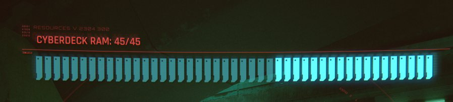
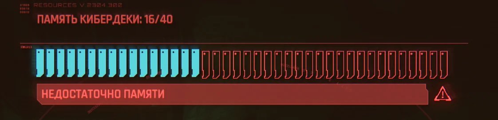

<div align="center">

# 🔷 Cyber-RAM

**Monitor de RAM para Waybar con la estética CYBERDECK de Cyberpunk 2077**


</div>

---

## Qué es esto

Un módulo para [Waybar](https://github.com/Alexays/Waybar) que muestra el uso de RAM del sistema replicando, chip por chip, el indicador de memoria del cyberdeck en **Cyberpunk 2077**: módulos cian brillante cuando hay memoria libre, contorno rojo apagado cuando está ocupada.

| Memoria libre (juego) | Memoria casi agotada (juego) |
|:---:|:---:|
|  |  |

Esto es la réplica funcional, alimentada por datos reales de `/proc/meminfo`:

```
CYBERDECK RAM
RESOURCES V.2304.900 // MEMORY STATUS

[ chips cian ████████░░░░░░░░ chips rojos ]

USADA: 13.7 GB   DISPONIBLE: 18.3 GB   TOTAL: 32 GB   USO: 43%
```

---

## Índice

- [Características](#características)
- [Estructura del proyecto](#estructura-del-proyecto)
- [Requisitos](#requisitos)
- [Instalación](#instalación)
  - [Automática](#instalación-automática)
  - [Manual](#instalación-manual)
- [Configuración](#configuración)
- [Rendimiento](#rendimiento--consumo-de-recursos)
- [Personalización](#personalización)
- [Solución de problemas](#solución-de-problemas)
- [Contribuir](#contribuir)
- [Licencia](#licencia)

---

## Características

- 🔷 **Geometría de chip idéntica al juego** — rectángulo con muesca diagonal en la esquina superior derecha y pin stub inferior, renderizado en SVG vectorial (escala perfecta a cualquier resolución).
- 🌡️ **3 estados de color** en la barra: normal (cian), warning (ámbar, ≥60%), critical (rojo parpadeante, ≥80%).
- 🖱️ **Popup interactivo** al hacer clic — ventana flotante sin bordes con el panel completo de 45 chips, se cierra sola al perder el foco.
- ⚙️ **Flag `brillo`** — activa o desactiva el efecto de resplandor (glow) en los chips libres, para sistemas con GPU integrada modesta o por gusto estético.
- ↔️ **Llenado direccional** — los chips se ocupan de derecha a izquierda según sube el uso de RAM, igual que en el juego.
- 🪶 **Ligero por diseño** — lectura directa del kernel vía `/proc/meminfo`, sin polling agresivo, sin dependencias pesadas en el módulo de barra.

---

## Estructura del proyecto

```
Cyber-RAM/
├── install.sh                  # Instalador automático
├── LICENSE
├── README.md
├── scripts/
│   └── ram-status.sh           # Lee /proc/meminfo → JSON para Waybar
├── waybar/
│   ├── ram-popup.py            # Lanzador GTK + WebKit2 del popup
│   ├── ram-popup.html          # Panel visual (45 chips, SVG)
│   ├── config-snippet.jsonc    # Bloque a pegar en config de Waybar
│   └── style-snippet.css       # Estilos a pegar en style.css de Waybar
└── assets/
    └── *.png                   # Capturas de referencia del juego
```

| Archivo | Se ejecuta... | Rol |
|---|---|---|
| `ram-status.sh` | cada N segundos (Waybar) | Texto/clase del módulo en la barra |
| `ram-popup.py` | al hacer clic | Abre la ventana del panel |
| `ram-popup.html` | dentro del popup | Dibuja los 45 chips con SVG |

---

## Requisitos

- [Waybar](https://github.com/Alexays/Waybar) compilado con soporte para módulos `custom`
- `bash`, `awk`, `free` (paquete `procps-ng`, viene por defecto en casi todas las distros)
- Para el popup interactivo: `python-gobject` y `webkit2gtk-4.1`

En **Arch / CachyOS**:

```bash
sudo pacman -S waybar python-gobject webkit2gtk-4.1
```

Fuentes opcionales para el look exacto (Share Tech Mono + Rajdhani se cargan vía Google Fonts automáticamente si hay conexión; si prefieres tenerlas localmente):

```bash
sudo pacman -S ttf-share-tech-mono
paru -S ttf-rajdhani          # disponible en AUR
```

---

## Instalación

### Instalación automática

```bash
git clone https://github.com/tu-usuario/Cyber-RAM.git
cd Cyber-RAM
chmod +x install.sh
./install.sh
```

El script comprueba dependencias, copia los archivos a `~/.config/waybar/scripts/` y te muestra los fragmentos que faltan por pegar a mano (config y CSS, ver abajo).

### Instalación manual

```bash
mkdir -p ~/.config/waybar/scripts
cp scripts/ram-status.sh waybar/ram-popup.py waybar/ram-popup.html ~/.config/waybar/scripts/
chmod +x ~/.config/waybar/scripts/ram-status.sh ~/.config/waybar/scripts/ram-popup.py
```

**1.** Añade el módulo dentro de `"modules-right"` (o donde prefieras) en `~/.config/waybar/config`, y pega el bloque de `waybar/config-snippet.jsonc` en la sección `"modules"`:

```jsonc
"custom/cyber-ram": {
  "exec": "~/.config/waybar/scripts/ram-status.sh",
  "interval": 5,
  "return-type": "json",
  "format": "󰍛 {}",
  "on-click": "python3 ~/.config/waybar/scripts/ram-popup.py",
  "tooltip": true
}
```

**2.** Añade el contenido de `waybar/style-snippet.css` al final de `~/.config/waybar/style.css`.

**3.** Recarga Waybar:

```bash
killall waybar && waybar &
```

---

## Configuración

Todos los parámetros ajustables están centralizados al principio del `<script>` en `ram-popup.html`:

```js
const CONFIG = {
  SLOTS:       45,      // número de chips (igual que CYBERDECK RAM: 45/45 en CP2077)
  WARN_PCT:    80,      // % a partir del cual se muestra la alerta roja
  brillo:      true,    // true = glow en chips libres | false = sin efecto (más ligero)
  INTERVAL_MS: 2000,    // frecuencia de refresco del popup en ms
};
```

Los umbrales de color de la barra (no del popup) se ajustan en `scripts/ram-status.sh`:

```bash
WARN_THRESHOLD=60
CRIT_THRESHOLD=80
```

---

## Rendimiento / consumo de recursos

Pensado para no penalizar la batería en un portátil con CachyOS:

| Componente | Coste aproximado |
|---|---|
| `ram-status.sh` (por ejecución) | < 5 ms de CPU, < 1 MB de RAM, sin I/O a disco |
| Lectura de `/proc/meminfo` | 0 — es un archivo virtual del kernel, ya está en memoria |
| Popup (`ram-popup.py` abierto) | ~50–80 MB de RAM mientras está visible (motor WebKit2) |
| Popup en reposo | 0 — el proceso no queda residente, se cierra al perder el foco |

Con el intervalo por defecto (`interval: 5`), el script se ejecuta 12 veces por minuto: imperceptible frente al consumo habitual de un escritorio Linux. Si quieres exprimir aún más la batería, sube el intervalo a `10` o `30` — para un indicador de barra no hace falta más resolución temporal.

---

## Personalización

- **Cambiar colores**: las variables de color están como literales hexadecimales en los bloques `<style>` de `ram-popup.html` (`#00c8e0` cian, `#cc1a1a` rojo) — búscalas y reemplázalas.
- **Quitar el glow por defecto**: pon `brillo: false` en `CONFIG` dentro de `ram-popup.html`.
- **Cambiar el número de chips**: ajusta `SLOTS` en `CONFIG` — el SVG se recalcula automáticamente para llenar el ancho disponible.
- **Icono de la barra**: el `󰍛` en `config-snippet.jsonc` es un glyph de [Nerd Fonts](https://www.nerdfonts.com/); cámbialo si no tienes esa fuente instalada.

---

## Solución de problemas

**El popup no abre / aparece una ventana en blanco**
Comprueba que `python-gobject` y `webkit2gtk` están instalados y que la ruta en `on-click` coincide con donde copiaste los scripts.

**Las fuentes no se ven como en la imagen**
`ram-popup.html` carga *Share Tech Mono* y *Rajdhani* desde Google Fonts; sin conexión a internet usará las fuentes monoespaciadas del sistema. Instala las fuentes localmente si quieres el resultado exacto sin depender de la red (ver [Requisitos](#requisitos)).

**El módulo no aparece en la barra**
Revisa que `"custom/cyber-ram"` esté también listado en `modules-left`, `modules-center` o `modules-right` — añadirlo solo a `"modules"` no es suficiente en Waybar.

---

## Contribuir

Las pull requests son bienvenidas. Para cambios grandes, abre antes un issue para discutir qué te gustaría modificar.

```bash
git checkout -b feature/mi-mejora
git commit -m "Añade mi-mejora"
git push origin feature/mi-mejora
```

---

## Licencia

[MIT](LICENSE) — haz lo que quieras con esto, una mención está bien pero no es obligatoria.

---

<div align="center">
<sub>Inspirado en el HUD de <strong>Cyberpunk 2077</strong> (CD Projekt Red). Proyecto de fans, sin afiliación oficial.</sub>
</div>
